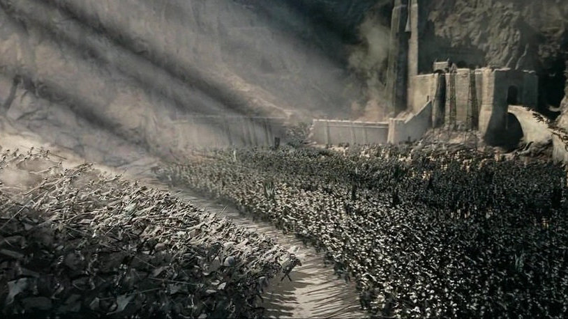
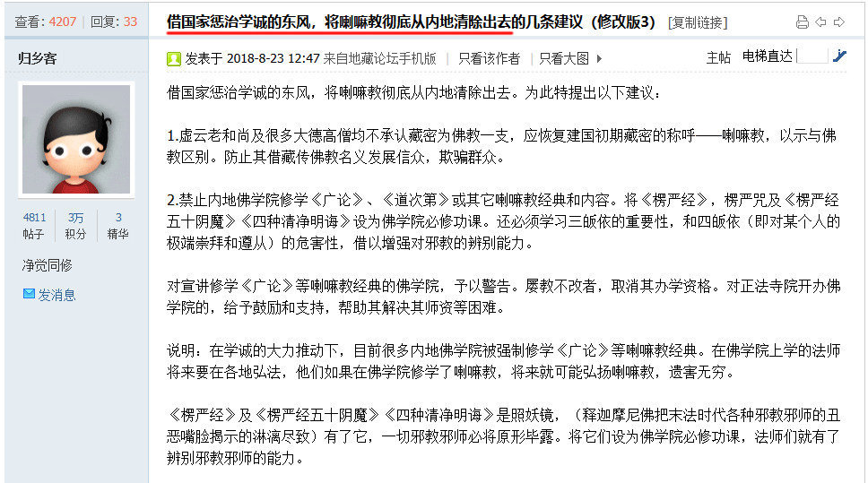

# 学诚事件显现台湾正觉同修会邪教的幕后黑手

【作者匿名，全文转发】

## 一、最初的猜想

末学2018年8月1日前一天，先听到这个事情传闻，随后就看到新闻与铺天盖地的网络舆论大潮，甚是震惊，上网一搜索，发现大部分揭露内幕文章都出自地藏论坛，末学十多年前经常登录论坛，时隔近十年，末学再次登录论坛，由论坛帖子提供的链接，浏览了95页材料所陈述的基本“事实”，作为一名从业多年的科研工作者，末学秉着宁可信其有，不可信其无的严肃客观立场，对其全部材料内容以“基本可信”的态度来加以研究，并没有因事件当事人是自己师父而感情化的加以抵制与否认，但凭着一名科研人员的严谨职业习惯,以及自己作为龙泉寺资深居士对龙泉寺情况的亲身所闻，对其中不合常理的内容，提出自己的理性质疑与意见，目的是希望有关各方能够提供真实的证据，能让末学了解最真实情况。

末学很是奇怪，就是每当末学发布质疑意见时，后面就会出现一堆跟帖，直接对末学施以人身攻击，而不是客观看待其中的明显疑点，这些跟帖纷纷惊异末学竟然在论坛“潜伏”、“卧底”十年，末学当时想当然地认为这可能是论坛的最新网络用语，并没有多想，直到后来才明白，这实际是贼喊捉贼，因为只有自己是潜伏卧底的人，其才会把人想成为“潜伏”与“卧底”。

末学一边看帖，一边研究这些发帖人员的以往发帖与跟帖，突然发现一个规律，那就是所有针对龙泉寺学诚大和尚的发贴者，都同时攻击藏传佛教，其中最活跃的跟帖者，大都是萧平实弟子，他们一看到支持藏传佛教的发帖人，都跟面见仇人一样，群起而攻之。他们见到同情支持龙泉寺学诚大和尚的跟帖，也同样群起而攻之，虽然他们的跟帖话语大同小异，但这些跟帖者的跟帖步调全都非常一致。

因为末学早在十年前就在地藏论坛与萧平实弟子密集辩论过“如来藏与阿赖耶识”，对萧粉理念与语言特点比较熟悉，也很敏感，这就像练武之人，一交手就知道对方是哪一门派一样，而无论其是否承认自己是萧粉。

最可笑的是，他们总把学诚事件的背后力量暗示为政府，采用种种吓人的口吻恫吓末学。以末学的人生经验，真正的背后力量绝不会自暴身份，越是暗示自己身份的，其实际越不是。

末学因此怀疑学诚事件可能是萧平实正觉会筹划运作的。当时，论坛上的支持龙泉寺的发帖跟帖人，见末学提出此看法，大都持否定意见，他们觉得一个远在台湾的邪道组织——萧平实同觉会不可能有这么强的能量与力量。

对末学来说，那当时仅仅是一个猜想。

## 二、猜想得到初步验证

随着事件的延续发展，越来越令人大跌眼镜。那就是末学惊奇地发现，后来遍布网络的第二波攻击学诚大和尚与北京龙泉寺的文章，竟然有很多内容都是先在地藏论坛上反复讨论过的内容，许多内容就是经过末学质疑后而加以修证的，只是去掉了那些非常明显的疑点,这激起了末学的极大惊异与警觉。

这第二波材料诬称学诚大和尚与北京龙泉寺法师是日常法师弟子，而日常法师又拜达赖喇嘛为师，这就把学诚大和尚与达赖喇嘛、与出了问题的福智僧团给硬扯在一起，同时又把学诚事件与藏传佛教联成一块。

因为自己在龙泉寺内部承担多年义工，这第二波攻击所提到的情况与末学所了解的北京龙泉寺的真实理念与情况完全没有一点关系。学诚法师与日常法师只是一种佛法交流关系，这可以从学诚居位主日常法师居客的合影照片清楚可以证明，学诚法师非常注重礼节，非常尊敬师长，对比学诚法师恭迎师长定海长老的情景，明显可以看出这完全是两种截然不同的礼节：http://t.cn/h4ADmA

末学的最初猜想由此而得到进一步确认，那就是发布第二波攻击北京龙泉寺的文章与那95页举报材料的原始创作者，都是同一个团队，其核心成员经常在论坛上发帖与跟帖。

## 三、猜想得到进一步地确认

随着事件的再进一步发展，就是随后发生的大宝法王事件，其运作手法与手段，与学诚事件非常相似，那就是都有一个女受害人，攻击目标都指向藏传佛教。

最有意思的是，北京龙泉寺贤超法师微博，说自己在2019年元月前曾遭到一两个女人连续三个多月的持续情色诱惑与骚扰，法师如果有一句回复模棱两可，被其抓到把柄，都可以以类似学诚事件与大宝法王事件的手法施以攻击，好在贤超法师持戒精严，经受了考验，没留下给对方任何可以捏造的把柄。

这同时也暴露了该组织运作的真实手段。有经验的警察都知道，罪犯一旦得手成功，会把其“成功”的犯罪经验，施以进一步的推广与扩展。这惊人的一幕，启发了末学，那就是将这些事件联立起来，向前反推，那就是学诚事件，完全可以采用同样的手段如法炮制。

## 四、末学对整个事件所作的分析与推演

当末学2019年春节前又看到学诚事件发布后的这篇贴子时，一下子就明白了这些人做这件事情的真正动机与目的: http://t.cn/Rk3uTMs

于是，末学把所有相关事件与这些人所发的帖子联系在一起研究，对学诚大和尚事件背后的力量与背景就有了一个全面而立体的轮廓，末学随后就在该帖对整个事件的发生过程作了如下的推演：

其实整个这个事件的策划运作手法非常简单，实施成本非常低廉。因为萧平实同觉会大陆有大量痴迷信徒，因为同觉会本身就是邪教，其痴迷信徒对萧平实同觉会非常忠心，因为其采用邪教控制信徒的手段，其对信徒的精神控制远远超过正常宗教。

同觉会可以调动它的大量一线铁杆信徒加入对外完全敞开大门的北京龙泉寺信徒圈，经过几年的布局与组织渗透，有一些人甚至直接进入出家人的行列，甚至进入核心圈，当这个大网逐渐成型的时候，就可以整个收摄这个大网，这时，所有的内线人员就可以以各种各样的角色，来共同运作同一件事，那就是对首要者全面发动攻击，他们把攻击目标的时间拿捏的非常精准，那就是赶在世界佛教论坛即将在福建广化寺召开的前半年到一年开始加以酝酿准备，然后在大会召开前几个月集中发动攻击，这样就可以把中国佛教形象在这个非常特殊的时刻加以非常严重地破坏，有的内线是给大和尚发频繁地发暧昧短信，有的通过木马控制大和尚的手机给对方发短信，有的则直接控告大和尚和自己发生关系，所有的目标都直指同一件事。

与世间生活完全隔绝多年的北京龙泉寺法师，哪里见过这样的阵势，哪里能想到会有这样一个庞大的大网在撒向北京龙泉寺，一些对学诚大和尚有信心的弟子轻易不会相信，但一些对学诚大和尚原本就有些意见的法师，在这种时候一发生动摇，就很容易被这些线人的诬告欺骗，从而加入“为民请命，伸张正义”的行列。

末学为什么这样判断呢？因为学诚事件发生后，北京龙泉市内部所有应对内幕与细节消息，都瞬间暴露在媒体与论坛，其很多非常核心的开会内容，内部还没传达，就已经第一时间公布到论坛。同时，网络上还一下子出现许多以北京龙泉寺为攻击目标的微博与微信群，整天编造真真假假的材料攻击北京龙泉寺，而这些微信微博持有者，既熟悉掌握北京龙泉寺的内部情况，同时又都秉持与台湾同觉会同样的思想理念，一看其攻击内容与攻击语言，就知道这些人都是有备而来，都是提前布置好的，其语言风格完全突破一个佛教信徒应有的人格底线，其攻击目标也不仅仅只局限于北京龙泉寺，而是攻击整个中国佛教,更把所有问题直指藏传佛教。包括95页材料署名人贤佳法师，其后续发言在越来越向台湾同觉会的思想理念靠近与相近。

因为整个事件都是事先周密策划好的，相关材料也早已准备多年，又因为事件本身的严重吸引眼球性，再借助网络的不可思议放大作用与自己网络水军的推波助澜，其瞬间就可以把一个事先周密策划的事件搞的就跟一个真实事件的新闻轰动效应一样，让毫无准备的相关各方疲于应付，毫无防范应对手段，巨大的新闻风暴与社会舆论媒体的力量一旦发动起来，要击垮一个看似组织团结的庞大宗教团体的信心就变得非常容易。

最可怕的是，相关渗透人员直到目前，还隐藏在龙泉寺组织内部，继续发挥向外披露内部信息等相关的破坏作用，令人防不胜防，相关事件的社会影响至今还在持续地发酵。

以上内容全是末学根据自己在论坛上所观察到的情况与各种蛛丝马迹所作的分析与推演，相关内容可以通过末学当时的相关跟帖为依据。

末学当时发布此跟贴的目的，也是想试探一下萧平实同觉会弟子对此所作的反应。结果发现：平常都立马跟帖反击的众多萧粉，突然全都变得长时间沉默不语，同时又不能不作任何反馈，最后只好故作镇定地“谢谢顶贴”，这显然是希望该贴永沉水底的冷处理手法，攻击龙泉寺的其他帖子时常被萧粉不断更新，唯独这个帖子一直默默潜沉水底。这在某种程度上就等于默认了末学的猜想与推演，萧平实同觉会希望事件真相越晚澄清越好。

## 五、分析与推演得到多渠道证实与确认

对一个科研工作者来说，如果他对某一事物与事件的猜想与推演得到部分佐证与证实时，那通常也是对其整个分析与推演的全面验证与证实。

末学就把自己的分析与推演发送给网络上自发护持龙泉寺的其他师兄时，他竟然对我所作的分析与推演丝毫不感到奇怪，这使我更加地惊奇与好奇，因为他从其他渠道所得的信息，远远比我的推演与分析更确切而具体，这就是他为什么对我经过大量分析所反馈的材料丝毫不感冒的主要原因。

从他发给我的一个义工反馈材料来看，大都证实了末学对整个事件的主要分析与推演。那95页材料全部出自贤启法师的一个义工团队，末学还认识那个主要策划人J，J当初之所以离开北京龙泉寺义工团队，是被当时的执事法师撤换的，接她岗位的师兄，刚好跟末学比较熟悉，曾经给末学多次讲起，她因此对该法师对龙泉寺都很有意见，因为J是一位资深老义工，为龙泉寺的某团队事业付出了很多努力与贡献，但关键是她不愿沿着龙泉寺优秀义工发展模式进一步发展——出家，同时又在佛教团体常住多年，很难再回到染污的世间环境，她于是就转到了贤启法师主持的北京龙泉寺下院普济寺，她因为心里不满，就经常跟贤启法师揭示她所理解与知道的北京龙泉寺其他法师内幕，言语里充满了愤恨。梵因法师揭露福智僧团事件发生后，她就劝贤启法师参照梵因法师揭露福智僧团模式揭露北京龙泉寺，协助J的一位H姓义工是国内一家超大型手机通讯制造公司的技术人员，正是通过该义工的专业技术手段，控制了学诚大和尚手机，然后以师父名义，给J所认识的尼众发送骚扰短信，然后再收集相互间的短信，来编制学诚大和尚事件的相关辅助证据。

末学刚接到这个材料，并没有立即全部采信，因为J在龙泉寺时曾经给末学留下非常美好的印象，于是，末学就向曾经与J关系很好的其他老义工相互交流，交流对学诚事件的看法与见解，同时也从侧面了解J后来的情况与转变，其他老义工说自己在事件发生前半年曾经接到J发送给他的同觉会攻击藏传佛教的相关材料，有的老义工同时还确认了贤启法师离开龙泉寺，主持普济寺后，私下里曾说过一些明显与北京龙泉寺佛法理念不同的说法与开示。

## 六、对95页举报材料的二次再分析

当末学确认这些情况后，翻回来再仔细阅读那95页材料，发现95页材料中关于事实陈述的90%内容都来自短信，而所有证明“犯罪”的短信记录都集中发生在2017年12月至2018年1月，而且所有被短信侵扰的比丘尼都与J曾经是同一个团队的义工“同事”。J之所以想做这件事，主要是想换掉北京龙泉寺的当家师学诚大和尚以及当年撤换她的执事法师，所以，X所发的短信，都想方设法以大和尚的口气，把相关比丘尼往相关的目标加以暗示与引导，以此来制造证据,贤甲与贤乙显然都误以为骚扰短信就是发自师父本人。

唯一举报师父与自己发生关系的是贤丙，从她所描述的细节来看，那个抽烟喝酒加吃肉的“师父”，显然是根据世间人的想象编写的，95页材料中的绝大部分的所谓事实，都与贤丙短信有关，从贤丙与师父短信交流内容来看，其对话内容显然是此地无银三百两地为暴露而暴露，为揭短而揭短，真正的男女之间绝不会以那种低俗直白的语言相交流，这是一个常识，由此可见，这个所谓的贤丙，其就是那个潜伏的线人。

而那95页材料里关于双修的法理陈述内容与材料，清一色都拷贝自网络与论坛上的萧平实同觉会攻击藏传佛教的文章与材料。这可以说是那95页材料的整个精神指引与全部理论依据。这才是证明整个学诚事件背后黑手是萧平实同觉会的最重要证据。

## 七、总结与述评

萧平实同觉会之所以发动制造“学诚事件”，其真正的目的是打击和控制藏传佛教，同时再通过他们一手策划制造的“学诚事件”的声势与影响，推出几个专门监督与攻击佛教的微博，在佛教领域塑造一两个类似方舟子与新语丝的有影响媒体，建立一两个纯民间性质的中国佛教监督组织网络媒体，形成足够的舆论影响，从而在舆论方面控制整个中国佛教声音，为萧平实同觉会进一步向大陆渗透，争取更多思想文化与政治舆论的影响与支持。

〇

