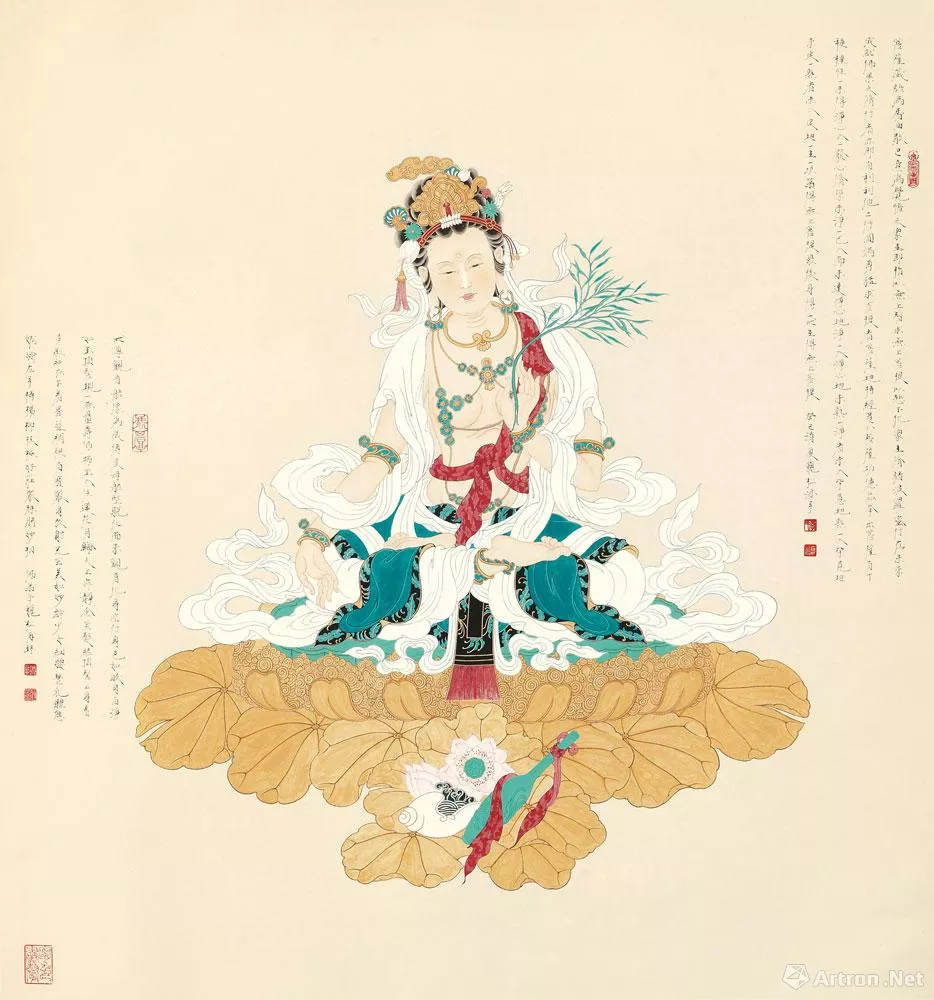

# 禅门子弟今犹在，斩猫锄蛇问双修

​　　宗门内外，千百年来流传着众多脍炙人口的祖师公案，其中不乏匪夷所思、乃至惊世骇俗的演出：丹霞烧佛、南泉斩猫、归宗锄蛇、赵州掐尼、婆子烧庵、济公喝酒吃肉……等等等等。

　　禅门子弟，正因为晓得这些公案，所以也不会贸然批判藏传佛教的双修问题。

　　为什么？

## 离言说、绝思量

　　因为禅宗的根本精神，就是“破相”——破除一切知见。

　　如著名的“破楞严”公案：“知见立，知即无名本；知见无，见斯即涅槃。”

　　通过语言文字、思维分别得来的东西，终归只是虚妄不实的凡情知见，不是诸佛如来的真宝摩尼。

　　当你轻易认为自己当前所知道的就是真理，你就会被“所知障”所障碍，把半山腰错认为涅槃山顶，从此停下寻求无上正等正觉的脚步。

　　甚至走上偏执极端、诽谤正法的歧路。

　　《楞严经》云：“若作圣解，即受群邪。”说的就是这个情况。

　　是故达摩大师云：“若不见性，说得十二部经教，尽是魔说，魔家眷属，不是佛家弟子。” 　　

　　天台教下是讲理的，而禅宗是蛮不讲理的。

　　禅宗讲“开口便错、动念即乖。”

　　禅宗讲“言语道断、心行处灭。”

　　禅宗讲“思而知，虑而解，皆鬼家活计。”

　　对自己貌似懂得的东西，清楚这个“懂得”不过是凡夫的虚妄情见，终非如来的究竟圆觉。

　　对自己确实不懂的东西，不去强加解释。

　　这个不懂，就是疑情；趁这疑情，正好去参；只要去参，就能开悟。

　　如果你认为自己懂了，不懂的强加解释也要认为自己懂了，那么请问，你的疑情呢？

　　没有疑情，你参什么？你不去参，怎么开悟？

　　所以俗话说：“小疑小悟、大疑大悟、不疑不悟。”

　　前代祖师们那些公案，就是苦心孤诣，留给后人去参的。

　　而且呢这个“参”，不是“思来想去”的“参”，而是“离心意识参”。

　　如《金刚经》云：“一切诸相、皆是虚妄；若见诸相非相，则见如来。”

　　如六祖大师所说：“不思善、不思恶，正与么时，那个是明上座本来面目。”

　　又如俗话说：“佛来佛斩、魔来魔斩”。

　　舍弃一切语言文字、思维分别、凡情圣解，舍弃坚固的我法二执，去探寻祖祖辈辈传说中的，那个“灵光独耀、迥脱根尘”的真心自性，到底是怎么一回事儿。

　　这就是“参”！

## 不解释、不仿效、不诽谤

　　现在我讲个一诚老和尚的公案给大家参参。

　　一诚老和尚当年在云居山，云居山是著名的农禅道场，每年都要种百十亩水稻。

　　有一年水稻生虫了，洒大悲水都治不了，眼看再不打药就要绝收了，可是谁来打药呢？大家一个个都不肯去，怕杀生，一诚老和尚就自己背上喷雾器去打了药。

　　这就是个公案，参参？

　　如果你要说：一诚老和尚慈悲啊！为了大众，不惜自己背业啊！

　　那么我问你：看你说得好像很有道理的样子。你这么明白，那你的疑情呢？

　　没有疑情，你参什么？你不去参，怎么开悟？

　　正如前面所说的，你用语言文字、思维分别去强加解释，解释得自己也满意了、别人也觉得蛮像那么一回事儿，但你有没有意识到：这些凡情圣解，一分钱都不值？

　　你有没有意识到：你这些牵强附会的“解释”，不但把“活泼泼、光灿灿”的宗门气象给解释得庸俗不堪，也障碍着你去寻求真正的答案、令你错失明心见性的大好机会？

　　如果你意识不到这一点，那么“若作圣解，即受群邪。”

　　你可能会去“仿效”，觉得一诚老和尚就敢打药杀虫，那么我也敢！我也去杀生！这就是“仿效”。

　　你可能会去“诽谤”，觉得一诚老和尚这不是犯杀戒嘛！怪不得他到老一身病啊！这就是“诽谤”。

　　“仿效”的结果，那就象济公活佛的诗：“酒肉穿肠过，佛祖心中留，世人若学我，如同进魔道。”

　　“诽谤”的结果，那就自己造下谤僧的恶业。

　　就像“罗什吞针”的公案，为什么他能吞针就可以娶一群老婆？他到底犯不犯淫戒、他到底造不造业、落不落因果呢？

　　无论你说他“落因果”还是“不落因果”，你都可能落个，五百世的野狐身！

　　特别是浪费了前代祖师们留给后人的，这些苦心孤诣的公案！

　　达摩大师云：“只言见性，不言淫欲。”

　　又云：“只言见性，不言作业。”

　　宗门曰：“往道上会！”

　　“往道上会”，就是说，当我们看到宗门中的前代祖师、当世大德，有什么匪夷所思、乃至惊世骇俗的言行，你若去解释、仿效、诽谤，横竖无非生死岸边事。

　　与明心见性、了生脱死，有何干系？

　　终归不胜一个“参”！

## 双修

　　宗门学禅，若能如是“往道上会”，看到祖师公案，不去师心自用，随意解释、仿效、诽谤，则我们于藏传佛教的“双修”问题，断然不会如现在的某些“反藏斗士”那般，偏执、极端、排他、封闭。

　　藏传佛教的“双修”，到底是怎么回事儿？

　　我也不晓得！

　　但是，对比禅宗中丹霞烧佛、南泉斩猫、归宗锄蛇、赵州掐尼、婆子烧庵、济公喝酒吃肉等等等等的祖师公案，藏传佛教的“双修”，一样的不可解释、不可仿效，但又不可诽谤。

　　下面做几个简单的对比。

### 对比一、看似犯戒非法

　　从表象上来看，双修是淫欲、或者邪淫。

　　那么从表象上来看：

　　丹霞烧佛，是不是出佛身血？是不是五逆重罪？

　　南泉斩猫、归宗锄蛇，是不是杀生？难道淫戒是四根本，杀戒就不是？

　　赵州掐尼、婆子烧庵，是不是淫欲、或者绮语？

　　济公喝酒吃肉，是不是违背《楞严经》四种清净明诲？

### 对比二、载入重要典籍

　　双修，作为藏传佛教的一种“禁行”，被堂而皇之记载在《密宗道次第广论》等重要典籍中。

　　特别有意思的是，宗喀巴大师创立黄教，整顿戒律，严禁出家人双修，但他又把双修这档子事儿，堂而皇之记载在《密宗道次第广论》。

　　而禅宗的众多祖师公案，一样也被堂而皇之记载在《五灯会元》、《景德传灯录》等重要典籍中。

### 对比三、需要极高证量

　　禅宗中的祖师们，之所以能做出前述看似犯戒非法的各种行为，因为他们已经明心见性，证量非同凡夫，如鸠摩罗什吞针娶妻、志公禅师吃鸽吐活公案。

　　而藏传佛教的双修，根据他们的说法，一样需要极高的证量才能修为。证量要高到什么程度呢？撒尿，尿出来以后，还能原样收回去，有这个本事，才能双修。

　　这个条件非常之高，根据他们的说法，当世几乎无人达到这个证量。

### 对比四、允许在家正淫

　　根据藏传佛教的说法，除非有极高证量，出家人不能双修。非要双修的话，你就还俗、结婚，如十世班禅大师。

　　那么这个跟汉传佛教在家居士允许正淫，有何区别？

### 对比五、存在法门败类

　　那么在藏传佛教中，是否存在着借双修之名骗财骗色的法门败类呢？当然大家都不会否认。像传说中的“朝阳区三十万散养仁波切”之类，也不排除少数来汉地骗财骗色的藏人。

　　那么在汉传佛教中，是否同样存在着法门败类？当然大家也不会否认，也不会因此就去攻击汉传佛教。

### 贪欲为道？

　　关于第三点，好像还存在着一些不同的说法。

　　禅宗的各种祖师公案，记载在典籍中，大家都知道祖师的各种行为，无非都是接引众生的方便，他们开悟了，所以他们可以做，我们没开悟，所以我们做不得。

　　但是藏传佛教的双修，记载在典籍中，还有另外一种说法，似乎是作为一种修行的途径，提供给薄地凡夫。

　　在这种说法中，出家人是绝对不能双修的，但是在家人的话就可以。

　　在家人双修之前，要先发这样的宏愿：“以即彼凡夫之贪欲为道，以大悲心，次第将此凡夫之贪欲转成遍起之菩提心，为利益一切有情，证得正等佛果。”

　　这就是传说中的“贪欲为道”，转化凡夫贪欲成清净菩提。

　　那么这个“贪欲为道”，到底是不是佛法呢？

　　我也不晓得！

　　但是比起来随意的解释、仿效、诽谤，这些极易断送自己和他人法身慧命的行为，我更愿意去起个疑情去“参”。

　　这是作为一个禅门子弟，理所当然的行为准则——往道上会！

　　〇